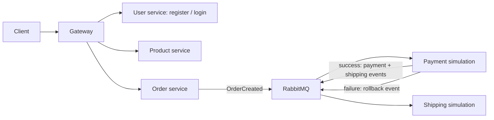

#  Harmony Platform

**Harmony Platform** is a modular, event-driven microservices architecture built with **Java 21** and **Spring Boot 3.2**.  
It simulates a basic e-commerce ecosystem using **RabbitMQ** messaging and service orchestration.

---

##  Features

-  Microservices-based architecture  
-  Order, Payment, and Shipping flows with saga-like event coordination  
-  Eureka Service Discovery  
-  RabbitMQ for asynchronous messaging  
-  API Gateway with dynamic routing  
-  Docker & Docker Compose support  
-  Prometheus monitoring integration  

---

##  Microservices

| Service             | Port | Description                             |
|---------------------|------|-----------------------------------------|
| `discovery-service` | 8761 | Eureka service registry for discovery   |
| `gateway-service`   | 8080 | API Gateway using Spring Cloud Gateway  |
| `user-service`      | 8081 | Manages user information and identities |
| `product-service`   | 8082 | Handles product listing and inventory   |
| `order-service`     | 8083 | Creates and manages customer orders     |
| `payment-service`   | 8084 | Simulates payment transaction flow      |
| `shipping-service`  | 8085 | Handles shipping operations             |

---

##  Tech Stack

- **Java 21**, **Spring Boot 3.2.4**, **Spring Cloud 2023.0.1**
- **RabbitMQ** (Event-driven messaging)
- **Eureka** (Service Discovery)
- **Docker**, **Docker Compose**
- **Gradle 8.14.3** (Build tool)
- **Prometheus / Grafana** (Monitoring)
- **ELK** (Centralized logging, `docker` profile only)
- **H2** in-memory database

---

## Configuration

### JWT signing key

Set `JWT_SECRET` to a random secret of at least 32 bytes before starting `user-service` and `gateway-service`. Both services must use the same value; there is deliberately no built-in application key. For example, in a POSIX shell:

```sh
export JWT_SECRET="$(openssl rand -hex 32)"
```

In PowerShell:

```powershell
$env:JWT_SECRET = [Convert]::ToHexString([System.Security.Cryptography.RandomNumberGenerator]::GetBytes(32))
```

Start local services from that shell, or run Docker Compose there so it inherits the value. If you use an IDE, add the value to both services' environment settings. Never commit it. Changing the key invalidates existing tokens. If a previously committed key was used outside a disposable local demo, rotate it in that environment.

Registration hashes passwords with BCrypt. Previously created plaintext demo accounts must be recreated; the in-memory H2 database is cleared when its service stops. Tests use their own test-only key and do not need this environment variable.

Every service defaults to **localhost** so it can run directly from your machine.
Docker Compose overrides those defaults with environment variables, so both modes
work from the same configuration:

| Variable                               | Local default              | Docker Compose value                    |
|----------------------------------------|----------------------------|-----------------------------------------|
| `EUREKA_CLIENT_SERVICEURL_DEFAULTZONE` | `http://localhost:8761/eureka/` | `http://discovery-service:8761/eureka/` |
| `SPRING_RABBITMQ_HOST`                 | `localhost`                | `rabbitmq`                              |
| `LOGSTASH_DESTINATION`                 | (unused)                   | `logstash:5001`                         |
| `SPRING_PROFILES_ACTIVE`               | (none)                     | `docker`                                |

Logstash output is only enabled under the `docker` profile, so local runs log to
the console without spamming connection errors.

---

##  Running Locally (without Docker)

###  Prerequisites

- **JDK 21** (the Gradle toolchain will provision one automatically if missing)
- **RabbitMQ** on `localhost:5672` — only needed for the order/payment/shipping flow

The other services run without any external infrastructure; they use in-memory H2.

### 1. Build every service

```bash
./gradlew buildAll
```

Each service is also a standalone Gradle build:

```bash
cd order-service
./gradlew build
```

### 2. Start the services

Start `discovery-service` first, then the rest in any order:

```bash
java -jar discovery-service/build/libs/app.jar
java -jar gateway-service/build/libs/app.jar
java -jar user-service/build/libs/app.jar
java -jar product-service/build/libs/app.jar
java -jar order-service/build/libs/app.jar
java -jar payment-service/build/libs/app.jar
java -jar shipping-service/build/libs/app.jar
```

Alternatively run a single service straight from Gradle:

```bash
cd user-service
./gradlew bootRun
```

If you need RabbitMQ without running the whole stack:

```bash
docker compose up -d rabbitmq
```

###  Running from IntelliJ IDEA

1. Open the repository root — the root `settings.gradle` pulls all seven services
   in as a composite build, so a single import covers the whole platform.
2. Set **Settings → Build Tools → Gradle → Gradle JVM** to **JDK 21**.
3. Ready-made Gradle run configurations live in `.run/` and appear in the run
   dropdown as `1 - discovery-service` … `7 - shipping-service`. Start them in
   that order.

---

##  Run with Docker Compose

```bash
docker compose up --build
```

> Ports 8080-8085, 8761 and 5672 are shared between both modes. Stop the
> containers (`docker compose stop`) before starting services locally.

###  Services will be available at:

-  Gateway: http://localhost:8080  
-  Eureka Dashboard: http://localhost:8761  
-  RabbitMQ UI: http://localhost:15672 (guest / guest)  
-  Prometheus: http://localhost:9090  
-  Grafana: http://localhost:3001  
-  Kibana: http://localhost:5601  

---

## Sample Flow



Register a user, log in and call a protected endpoint through the gateway:

```bash
curl -X POST http://localhost:8080/api/auth/register \
  -H "Content-Type: application/json" \
  -d '{"username":"temel","email":"temel@test.com","password":"1234"}'

curl -X POST http://localhost:8080/api/auth/login \
  -H "Content-Type: application/json" \
  -d '{"username":"temel","password":"1234"}'

curl http://localhost:8080/api/products -H "Authorization: Bearer <token>"
```

The event-driven order flow:

1. A user places an order via `order-service`.  
2. `order-service` publishes an `OrderCreatedEvent` to RabbitMQ.  
3. `payment-service` consumes the event and processes the payment.  
4. If payment succeeds, it publishes a `ShippingCreatedEvent`.  
5. `shipping-service` receives the event and completes the delivery.  

Each service acts **independently** and communicates via **events**.

---

## Troubleshooting

**`PKIX path building failed` while Gradle downloads anything**

TLS-inspecting antivirus software (Norton, Kaspersky, ESET…) re-signs HTTPS
traffic with a root certificate that only exists in the Windows certificate
store. Point Java at that store by adding the following to
`%USERPROFILE%\.gradle\gradle.properties`:

```properties
systemProp.javax.net.ssl.trustStoreType=Windows-ROOT
```

and set `GRADLE_OPTS=-Djavax.net.ssl.trustStoreType=Windows-ROOT` so the Gradle
wrapper can download the distribution itself.

**`Port 8761 was already in use`**

The Docker Compose stack is still running. Stop it with `docker compose stop`.

---

## Future Enhancements

- API documentation with Swagger/OpenAPI  
- Kafka support  
- Circuit Breakers (Resilience4j)  
- Distributed Tracing (Micrometer Tracing + Zipkin)  

## Verification and limitations

Run `./gradlew buildAll` (Windows: `.\gradlew.bat buildAll`) to build and test all seven services. The authentication tests check password hashing, successful login, and rejected credentials. Gateway tests check missing/malformed/expired tokens and forwarding the authenticated username instead of a client-supplied value. GitHub Actions runs the same build for pull requests and `main`.

This is a local learning platform, not a production deployment. Payment success is simulated; shipping is logged, and H2 data is ephemeral. Message redelivery is not yet deduplicated, so repeated messages can repeat side effects. Durable outbox delivery, idempotent consumers, production authorization/rate limiting, and hardened infrastructure remain future work. Compose exposes development services on host ports; do not deploy this configuration unchanged to the public internet.

The Swagger UI is available in `user-service` at `http://localhost:8081/swagger-ui.html`; platform-wide API documentation remains future work.

See [CONTRIBUTING.md](CONTRIBUTING.md) for contribution and verification steps.

---

## Author

**Ahmet Temel Kundupoğlu**  
*Java Backend Developer & Open Source Enthusiast*  
[**GitHub: AhmetTK4**](https://github.com/AhmetTK4)

## License

This project is licensed under the [MIT License](LICENSE).
